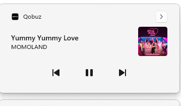

# Qobuz SMTC Dirty Fix

Restores **Windows media controls** to the Qobuz Desktop app — the media overlay, taskbar controls, and media key support that stopped working after version 7.2.0.



## Install

1. Install [Node.js](https://nodejs.org) (v16+)
2. Close Qobuz
3. Double-click `install.bat` (or run `node patch.js`)
4. Start Qobuz

To undo: `node patch.js --restore`

### Custom install path

If Qobuz isn't at the default location (`%LOCALAPPDATA%\Qobuz`):

```
node patch.js "C:\path\to\Qobuz"
```

## Features

- Track title, artist, album, and cover art in the Windows media overlay
- Play, pause, next, previous, and seek controls
- Live seek bar position
- Hardware media key support

## Notes

- Re-run after Qobuz updates
- The patch is safe to run multiple times
- Backups are created automatically (`*.backup` files)
- Tested on Qobuz 8.1.0 / Windows 11

## Why

Qobuz dropped native Windows SMTC support when upgrading Electron. This patch re-implements it using Chromium's `navigator.mediaSession` API with a sub-audible audio bridge.

## License

MIT
